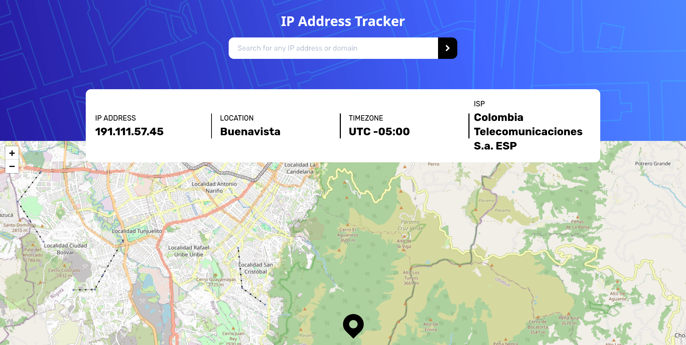

# Frontend Mentor - IP address tracker solution

This is a solution to the [IP address tracker challenge on Frontend Mentor](https://www.frontendmentor.io/challenges/ip-address-tracker-I8-0yYAH0). Frontend Mentor challenges help you improve your coding skills by building realistic projects. 

## Table of contents

- [Overview](#overview)
  - [The challenge](#the-challenge)
  - [Screenshot](#screenshot)
  - [Links](#links)
- [My process](#my-process)
  - [Built with](#built-with)
  - [What I learned](#what-i-learned)
  - [Continued development](#continued-development)
  - [Useful resources](#useful-resources)
- [Author](#author)


## Overview

### The challenge

Users should be able to:

- View the optimal layout for each page depending on their device's screen size
- See hover states for all interactive elements on the page
- See their own IP address on the map on the initial page load
- Search for any IP addresses or domains and see the key information and location

### Screenshot



### Links

- Solution URL: [Add solution URL here](https://github.com/cvalencia1991/API-adress-tracker)
- Live Site URL: [Add live site URL here](https://your-live-site-url.com)

## My process

### Built with

- Semantic HTML5 markup
- CSS custom properties
- Flex box
- CSS Grid
- Mobile-first workflow
- [Cypress](https://www.cypress.io/blog/2019/05/13/code-create-react-app-v3-and-its-cypress-tests-using-typescriptl)- typescript testing library
- [Vite](https://vitejs.dev/) - Setup environment 
- [Styled Loader](https://styled-components.com/) - For styles and loading information

**Note: These are just examples. Delete this note and replace the list above with your own choices**

### What I learned

Implement CreateAsyncThunk using typescript, allows me to implement the types when i landed the information to the client

```typescript
 export const fetchIpAddress = createAsyncThunk<IpAddressState,FetchIpAddressArgs,rejectValue>(
   'ipAddress/fetch', 
   async ({ ipAddress }, thunkAPI) => {
   try {
     const response = await fetch(`https://geo.ipify.org/api/v2/country,city?apiKey=${import.meta.env.VITE_APP_API_KEY}&ipAddress=${ipAddress}`);
     const data = await response.json(); 
     return data;
   } 
   catch (error: unknown) {
     if (typeof error === 'string') {
       return thunkAPI.rejectWithValue({ error });
     }
   return thunkAPI.rejectWithValue({ error: 'Unknown error' });
  }
 });
```
### Continued development

- [ ] Implement the buttons of the map to resize the map 

### Useful resources

- [React leaflet](https://react-leaflet.js.org/) - This help me to implement using react typescript components  


## Author

- Website - [Add your name here](https://www.your-site.com)
- Frontend Mentor - [@yourusername](https://www.frontendmentor.io/profile/yourusername)
- Twitter - [@yourusername](https://www.twitter.com/yourusername)
